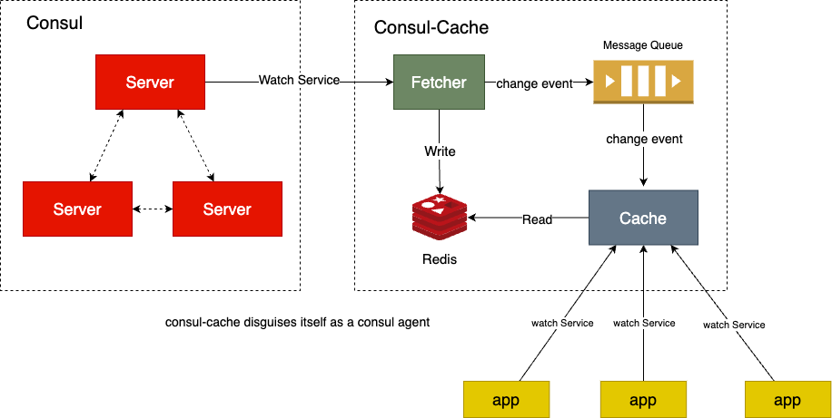

# consul-cache
[](https://github.com/vearne/consul-cache/actions/workflows/golang-ci.yml)

consul-cache is a local cache disguised as consul agent and has stronger performance.

## Purpose
In the consul cluster, when the app initiates a watch request, 
the consul agent will forward the request to the consul server, 
which will put a huge burden on the consul server. 
The purpose of consul-cache is to separate this burden from the consul server.

## Architecture
consul-cache has 2 components.
### fetcher
Discover service changes from consul and build all instances corresponding to the service in Redis
### cache
cache disguises itself as a consul agent to facilitate service discovery by business programs


 

## Quick Start with Docker compose
Switch to directory [docker_compose](https://github.com/vearne/consul-cache/tree/main/docker_compose)
```
cd docker_compose
```

### start

```
docker-compose up -d
```

### stop
```
docker-compose down
```
### Register and Discover
refer to this [document](https://github.com/vearne/consul-cache/tree/main/script/register/register_deregister.md)

#### Register through consul client
```
curl -X PUT --data @payload.json \
http://localhost:18550/v1/agent/service/register
```

#### Discover through consul-cache
```
curl 'http://localhost:18500/v1/health/service/web?dc=dc1&passing=true'
```
